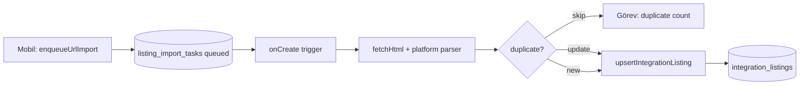
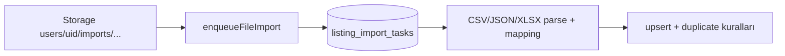
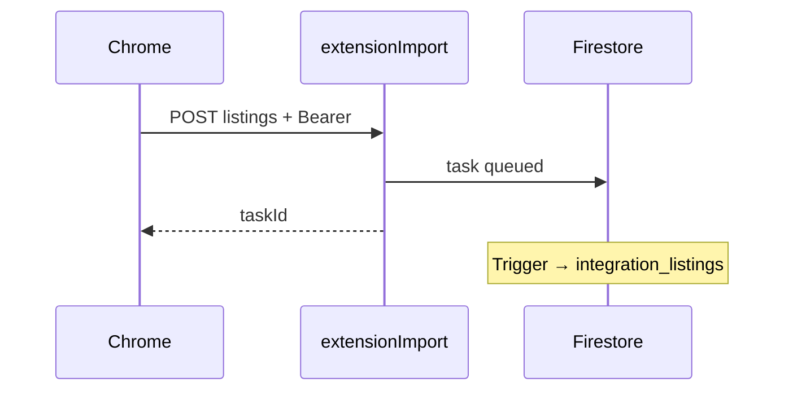

# Rainbow Core — Import Engine (üretim iskelesi)

Bu doküman URL / dosya / tarayıcı uzantısı içe aktarma, duplicate tespiti, senkron logları ve yönetici onayını tek yerde özetler.

## Dosya yapısı

```
emlakmaster_mobile/
├── functions/
│   ├── index.js                          # enqueueUrlImport, enqueueFileImport, onListingImportTaskCreated, extensionImport, …
│   ├── integrationListingsAdmin.js       # integration_listings upsert + duplicateFingerprint alanları
│   └── listingImportEngine/
│       ├── errors.js                     # ImportErrorCodes (INVALID_URL, PARSE_FAILED, …)
│       ├── constants.js                  # COL_LISTING_IMPORT_TASKS, COL_SYNC_LOGS
│       ├── urlPlatform.js                # Platform tespiti + URL’den id çıkarma
│       ├── fetchHtml.js                # Axios ile güvenli HTML çekimi
│       ├── parsers/                    # sahibinden / hepsiemlak / emlakjet (cheerio + meta/JSON-LD)
│       ├── duplicateService.js           # externalId + SHA256 fingerprint
│       ├── listingImportProcessor.js     # URL + extension batch + onay payload uygulama
│       ├── fileImportProcessor.js      # CSV / JSON / XLSX
│       ├── syncEngine.js                 # Manuel sync stub + integration_sync_logs
│       ├── authHelpers.js                # Manager rol + Bearer doğrulama
│       └── listingImportApi.js           # Callable + HTTP + Firestore trigger
├── lib/features/listing_import/          # Flutter: hub, geçmiş, repository, callables
├── extension/chrome/                     # MV3 iskelet (POST + Bearer)
└── firestore.rules / firestore.indexes.json / storage.rules
```

## API uçları (Firebase Functions, `europe-west1`)

| Tür | Ad | Açıklama |
|-----|-----|----------|
| Callable | `enqueueUrlImport` | `{ url, officeId?, importMode?, requireApproval? }` → `listing_import_tasks` **queued** |
| Callable | `enqueueFileImport` | `{ storagePath, fileName, mapping, platform?, … }` → **queued** |
| Callable | `adminApproveImportTask` | Yönetici: `{ taskId, decision, note? }` → preview → `integration_listings` |
| Callable | `runIntegrationListingSync` | `{ listingDocId, remoteSnapshot }` → hash diff + log |
| HTTPS | `extensionImport` | `Authorization: Bearer <Firebase ID token>`, body: `{ listings[], platform, … }` |
| Trigger | `onListingImportTaskCreated` | `listing_import_tasks` **onCreate** → işlemci |

**Uzantı URL örneği:** `https://europe-west1-<PROJECT>.cloudfunctions.net/extensionImport`

## Veri modelleri

### `listing_import_tasks`

- `ownerUserId`, `officeId`, `sourceType` (`url` \| `file` \| `extension`)
- `status`: `queued` → `processing` → `completed` \| `failed` \| `partial` \| `pending_approval`
- `platform`, `sourceUrl` \| `storagePath`, `mapping`, `importMode`, `requireApproval`
- `counts`: `{ imported, duplicates, errors }`
- `previewPayload`: onay bekleyen tek kayıt `{ docId, listingPayload }` veya toplu `{ batch: [...] }`
- `errorCode`: `ImportErrorCodes` ile uyumlu string

### `integration_listings` (genişletme)

- `duplicateFingerprint`, `duplicateGroupId`, `linkedDuplicateOf` (opsiyonel gruplama)

### `integration_sync_logs`

- `ownerUserId`, `listingDocId`, `state`, `changedFields`, `at`

## Veri akışı (özet)

### URL import



### Dosya import



### Uzantı



## Hata kodları

Sunucu: `functions/listingImportEngine/errors.js`  
İstemci: Snackbar / geçmiş ekranında `errorCode` alanından gösterilebilir.

## Dağıtım

```bash
cd emlakmaster_mobile
firebase deploy --only functions,firestore:rules,firestore:indexes,storage
```

İlk kurulumda Firestore bileşik indeksleri oluşturulması birkaç dakika sürebilir.

## Sonraki adımlar (önerilen)

1. **App Check** + HTTPS rate limit (`extensionImport`)
2. **Cloud Tasks** veya **Pub/Sub** ile iş kuyruğu (yüksek hacim)
3. **Görüntü benzerliği** (pHash) — `duplicateFingerprint` yanında ayrı skor
4. **Zamanlanmış senkron** — `scheduled` + `external_connections` adapter’ları
