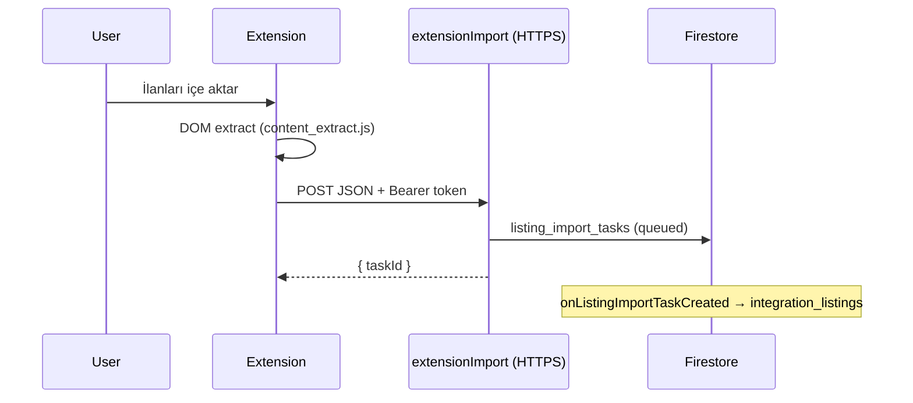

# Rainbow CRM — Chrome extension (import handoff)

## Güvenlik

- **Şifre veya kalıcı oturum çerezi toplanmaz.**
- Backend yalnızca **`Authorization: Bearer &lt;Firebase ID token&gt;`** ile kimlik doğrular.
- ID token’ı kullanıcı mobil uygulamadan kopyalayıp eklenti ayarına yapıştırabilir veya ileride OAuth PKCE / custom token akışı eklenebilir.

## Kurulum (geliştirme)

1. Chrome → `chrome://extensions` → Geliştirici modu → **Paketlenmemiş öğe yükle** → bu klasörü seçin.
2. `background.js` içinde `DEFAULT_IMPORT_URL` değerini projedeki gerçek URL ile değiştirin:  
   `https://europe-west1-<PROJECT_ID>.cloudfunctions.net/extensionImport`
3. `chrome.storage.local` ile:
   - `idToken`: Firebase Auth ID token (kısa ömürlü)
   - `platform`: `sahibinden` | `hepsiemlak` | `emlakjet` (opsiyonel; sekme host’tan da tahmin edilir)

## Akış

## Üretim kontrol listesi

- [ ] ID token yenileme (refresh) stratejisi
- [ ] CSP ve host izinleri minimumda
- [ ] Rate limit / abuse (Functions + App Check)
